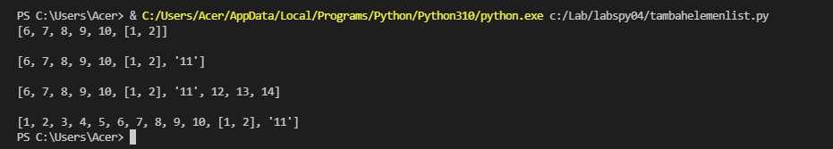
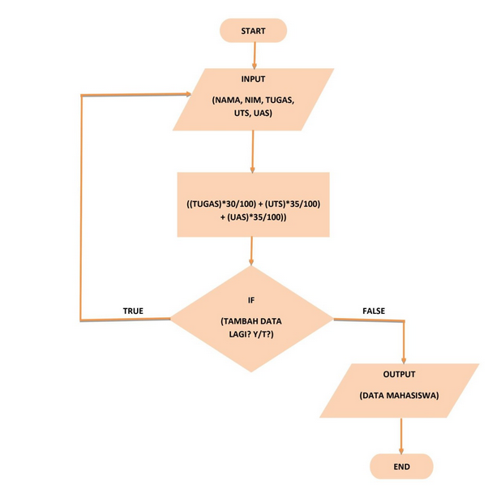

# **Tugas Pertemuan 09**

```sh
Nama    : Aef Saefuddin
Nim     : 312110521
Kelas   : TI.21.C5
Matkul  : Pemrograman
```

## **Latihan List**

### *Akses List*
Soal


Saya Mengerjakan Dengan *Syntax* Dibawah Ini 
```sh
# Akses List
## Menampilkan element ke-3
buah = ['jeruk', 'mangga', 'apel', 'anggur', 'alpukat', 'nanas']
print()
print("List :", buah)
print()
print('Buah dalam element ke-3 adalah', buah[3])
print()

## Ambil nilai element ke-2 sampai ke-4
print(buah[2:4])
print()

## Ambil element terakhir
print(buah[-1])
print()
```

#### **Output**
Dan Hasil Dari *Syntax* Yang Saya Buat Adalah


#### **Penjelasan**

```sh
Membuat List Dengan Nilai Yang Diinginkan
buah = ['jeruk', 'mangga', 'apel', 'anggur', 'alpukat', 'nanas']

Menampilkan Semua Elemen Yang Terdapat Yang Ada Di List Diatas
print("buah:", buah) 6

Untuk menampilkan salah satu element dalam sebuah list dapat menggunakan `buah[2]`
print('Elemen ke-3', buah[2])

Jika ingin mengambil elemen ke-2 sampai elemen ke-4 dapat menggunakan `buah[1:5]`
print('Elemen ke-2 sampai ke-4', buah[1:5])

Jika ingin mengambil elemen terakhir dapat menggunakan `buah[-1]`
print ('Elemen terakhir', buah[-1]
```

### *Mengubah Elemen List*
Soal


Saya Mengerjakan Dengan *Syntax* Dibawah Ini 
```sh
# Ubah element list
## ubah elemen ke-4 dengan nilai lainnya
buah = ['jeruk', 'mangga', 'apel', 'anggur', 'alpukat', 'nanas']
print()
print("List sebelum di ubah :", buah)
print()
buah[4] = 'semangka'
print("List sesudah di ubah :", buah)
print()

## ubah elemen ke 4 sampai dengan elemen terakhir
buah[4:] = ["pisang", "durian"]
print("Ubah element ke-4 hingga akhir :", buah)
print()
```

#### **Ouput**

Dan Hasil Dari *Syntax* Yang Saya Buat Adalah


#### **Penjelasan**
```sh
1. Membuat list dengan nilai yang diinginkan

buah = ['jeruk', 'mangga', 'apel', 'anggur', 'alpukat', 'nanas']
 2. Menampilakn semua elemen yang terdapat pada list diatas

buah[3] = 'leci'
print("buah sesudah di ubah:", buah)

3. Jika ingin mengubah elemen ke-4 sampai dengan elemen terakhir dapat menggunakan `buah[3:]`
buah[3:] = ["salak", "rambutan"]
print("ubah elemen ke-4 hingga akhir :", buah)
```
### *Menambahkan Elemen List*
Soal


Saya Mengerjakan Dengan *Syntax* Dibawah Ini 
```sh
# Tambah element list
## Ambil 2 bagian dari list pertama (A) dan jadikan list ke 2 (B)
a = [1, 2, 3, 4, 5]
b = [6, 7, 8, 9, 10]

b.append(a[0:2])
print(b)

## tambah list B dengan nilai string
print()
b.append("11")
print(b)

## tambah list B dengan 3 nilai
print()
print(b + [12, 13, 14])

## gabungkan list B dengan list A
print()
print(a + b)
```

#### **Output**
Dan Hasil Dari *Syntax* Yang Saya Buat Adalah


#### Penjelasan
```sh
1. Membuat list dengan variabel a dan b
a = [1, 2, 3, 4, 5]
b = [6, 7, 8, 9, 10]

2. Untuk mengambil 2 bagian dari list a dan dijadikan list b
b.append(a[0:2])
print(b)

3. Untuk menambahkan list b dengan nilai string 
b.append("11")
print(b)

4. Untuk menambahkan list b dengan 3 nilai
print()
print(b + [12, 13, 14])

5. Untuk menggabungkan list b dengan list a
print()
print(a + b)
```

## **Tugas Praktikum**
Soal

Saya Mengerjakan Dengan *Syntax* Dibawah Ini 
```sh
# List
_nama = []
_nim = []
_tugas = []
_uts = []
_uas = []
_akhir = []

# Input
while True:
    _nama.append(input("Masukan nama : "))
    _nim.append(input("Masukan NIM  : "))
    tugas = int(input("Nilai tugas  : ")); _tugas.append(tugas)
    uts   = int(input("Nilai UTS    : ")); _uts.append(uts)
    uas   = int(input("Nilai UAS    : ")); _uas.append(uas)

    _akhir.append(tugas * 30/100 + uts * 35/100 + uas * 35/100)
    print()
    _tanya = input("Tambah data lagi? [y/t]: ")
    print()
    if(_tanya == "t" or _tanya =="T"):
        break
# Output
print(73*"=")
print("| {0:^2} | {1:^18} | {2:^9} | {3:^5} | {4:^5} | {5:^5} | {6:^7} |".format("No", "Nama", "NIM", "Tugas", "UTS", "UAS", "Akhir"))
print(73*"=")

no = 0
for nama, nim, tugas, uts, uas, akhir in zip(_nama, _nim, _tugas, _uts, _uas, _akhir):
    no += 1    
    print("| {0:>2} | {1:<18} | {2:>9} | {3:>5} | {4:>5} | {5:>5} | {6:>7.2f} |".format(no, nama, nim, tugas, uts, uas, akhir))
print(73*"=")
```

### **Input**
*Flowchart* 


### **Output**
Dan Hasil Dari *Syntax* Yang Saya Buat Adalah


#### **Penjelasan**
```sh
1. Mendeklarasi list
_nama = []
_nim = []
_tugas = []
_uts = []
_uas = []
_akhir = []

2. Gunakan perulangan _while loop_ dengan nilai "True"
while True:

3. Menginput nama, nim, tugas, uts, uas, dan akhir dengan menambahkan method `.append`
 _nama.append(input("Masukan nama : "))
    _nim.append(input("Masukan NIM  : "))
    tugas = int(input("Nilai tugas  : ")); _tugas.append(tugas)
    uts   = int(input("Nilai UTS    : ")); _uts.append(uts)
    uas   = int(input("Nilai UAS    : ")); _uas.append(uas)

    _akhir.append(tugas * 30/100 + uts * 35/100 + uas * 35/100)


4. Pada input <b>Tambah Data Lagi?</b> apabila jawaban “t” atau “T”, maka program akan berhenti dan akan menampilkan hasil daftar datanya
_tanya = input("Tambah data lagi? [y/t]: ")
    print()
    if(_tanya == "t" or _tanya =="T"):
        break

5. Untuk membuat header table, menggunakan `print(73*"=")`, fungsinya membuat "=" sebanyak 73 sebagai garis, dan menggunakan format string
print(73*"=")
print("| {0:^2} | {1:^18} | {2:^9} | {3:^5} | {4:^5} | {5:^5} | {6:^7} |".format("No", "Nama", "NIM", "Tugas", "UTS", "UAS", "Akhir"))
print(73*"=")

6. Deklarasi `no = 0` untuk membuat nomor pada isi table, lalu membuat perulangan dengan `for`
- Perulangan `nama, nim, tugas, uts, uas`, sesuai urutan yang ada di dalam `zip`
- Pada list yang dimaksud, `in zip` berfungsi untuk membungkus semua list
no = 0
for nama, nim, tugas, uts, uas, akhir in zip(_nama, _nim, _tugas, _uts, _uas, _akhir):

7. Membuat isi tabel sesuai keinginan dengan format string
no += 1    
    print("| {0:>2} | {1:<18} | {2:>9} | {3:>5} | {4:>5} | {5:>5} | {6:>7.2f} |".format(no, nama, nim, tugas, uts, uas, akhir))

8. Untuk membuat footer atau garis paling bawa ketika looping isi table selesai
print(73*"=")
```
# **Selesai**